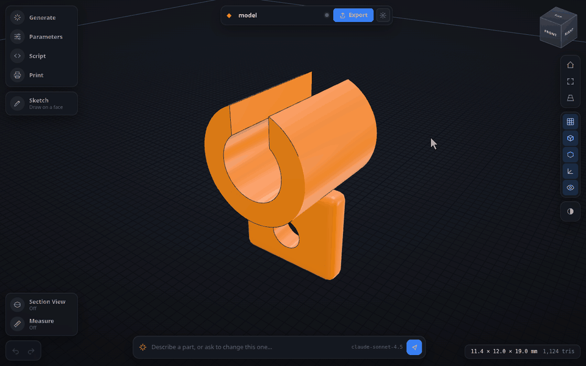

# PartSmith

**Describe a part in plain words, get a printable STL.** Entirely in your browser.

[**Live demo**](https://kzorluoglu.github.io/partsmith/) · no signup, bring your own
[OpenRouter](https://openrouter.ai/keys) key



*Orbiting with the view cube, scrubbing a parameter, then a base plate sketched on the grid,
typed to 30 × 20 mm and pulled up 2 mm, two holes cut into it and the plate measured. The AI
prompt sits in the bar at the bottom; generating needs your own OpenRouter key, so this clip
starts from the built in example part.*


Most "AI 3D" tools hand you a mesh: a blob of triangles you cannot edit, usually not
watertight, rarely printable. PartSmith asks the model for **parametric CAD code** instead.
You get a solid you can actually change, with sliders for every dimension, a printability
check, and STL or 3MF export.

```
your prompt ──▶ LLM writes a JSCAD script ──▶ real solid geometry
                                                    │
                          sliders · print check · STL / 3MF
```

- **Editable, not frozen.** Every dimension is a parameter with a slider. Move it, the
  model rebuilds.
- **Printability is checked, not assumed.** Watertightness, build volume fit, overhang
  area, wall thickness, filament weight and cost.
- **It fixes its own mistakes.** When a generated script throws, the error goes back to the
  model once and the corrected version is rerun.
- **Nothing leaves your machine except the prompt.** No backend, no accounts, no telemetry.
  Your API key stays in `localStorage`.
- **Any model you like.** Anything OpenRouter serves, from Claude and GPT to free ones.

## Sketch and extrude

The AI writes the base part, then you shape it by hand like in Shapr3D:

1. **Sketch** in the left rail turns the rail into the sketch toolbox: Line,
   Rectangle, Circle, Polygon, Ellipse. Clicking the active tool again switches
   its variant (corner or centre rectangle, 3 to 8 sided polygon).
2. Click a face of the part, or the grid for a new body. That face becomes the
   sketch plane, no separate selection step.
3. Dimensions are pills right beside the geometry. Just type a number, it goes
   into the active pill, `Tab` moves to the next one, `Enter` places the point.
   A typed value locks that dimension while the mouse keeps driving the rest.
4. A closed profile gets an arrow. Drag it or type a distance and press
   `Enter`. Positive adds material, negative cuts, **Flip** switches.

**Measure** snaps to corners and edge midpoints, **Section View** cuts the part
along X, Y or Z to check walls and holes. Parameters take a slider, an exact
value with arrow key stepping, or a drag on their label.

Sketch features stay data on top of the script, so the sliders keep working and
the AI can keep refining. **Bake into script** writes them out as JSCAD code.

## Run it

```bash
npm install
npm run dev      # http://localhost:5173
```

Open the app, paste an OpenRouter key from <https://openrouter.ai/keys> into the settings
dialog and start asking for parts.

```bash
npm run build    # static bundle in dist/, host it anywhere
npm run preview
```

## How it works

```
prompt ──▶ OpenRouter (streamed) ──▶ JSCAD script
                                        │
                              worker: evaluate + tessellate
                                        │
                     ┌──────────────────┼──────────────────┐
                three.js viewer    print check       STL / 3MF
```

- **`src/lib/jscad.worker.js`** — the only place that touches JSCAD. It compiles the script
  in a `new Function` sandbox, runs `main(params)`, drops the result onto z = 0, turns the
  polygons into triangle buffers and computes the print metrics. It also owns the STL and
  3MF serializers so nothing large crosses back to the main thread twice.
- **`src/lib/runner.js`** — promise wrapper around the worker, with a hard timeout that
  terminates and replaces a worker stuck in an endless loop.
- **`src/lib/scene.js`** — three.js: build plate, grid, build volume cage, orbit controls,
  shading modes. Deliberately plain module state, so none of it ends up inside Gea's
  reactive proxy.
- **`src/lib/canvas2d-renderer.js`** — fallback for machines without WebGL, which on Linux
  laptops usually means graphics acceleration is switched off. Same scene and same orbit
  controls, but the triangles are projected, depth sorted and filled on the CPU. It only
  redraws when something changed, so an idle view costs nothing.
- **`src/lib/prompt.js`** — the system prompt. This is what decides whether the generated
  parts are printable: the JSCAD API the sandbox exposes, plus wall thickness, overhang,
  clearance and orientation rules.
- **`src/stores/*`** — Gea stores. `model-store` holds the script and everything derived
  from the last run, `ai-store` runs the generate / refine / repair loop, `settings-store`
  persists printer, material and viewer preferences.

### Printability checks

- **Watertight** — the vector area of a closed surface sums to zero. Edge matching was the
  obvious approach and is wrong here: JSCAD's boolean ops leave T-junctions on perfectly
  valid solids, and an edge test flags every one of them.
- **Build volume** — bounding box against the selected printer.
- **Overhang** — total area of downward faces steeper than 45°, ignoring what sits on the
  plate.
- **Material** — volume scaled by shell plus infill, converted to grams, metres of 1.75 mm
  filament and a rough cost.

### Self repair

When a generated script throws, the error and the script go back to the model once and the
corrected version is rerun. The chat shows that as a `retry` line.

## Stack

[Gea](https://github.com/dashersw/gea) (compile-time JSX, proxy stores, no virtual DOM),
three.js, @jscad/modeling, CodeMirror 6, Vite.

Two Gea details worth knowing before editing the UI:

- JSX only compiles inside `template()` or a default exported function. A helper method that
  returns JSX compiles to broken code, see `param-control.tsx` for the way around it.
- Components are `.tsx`. Vite's dependency scanner does not run the Gea plugin and resolves
  plain `.jsx` against React's runtime, which fails the scan. `tsconfig.json` points
  `jsxImportSource` at `@geajs/core` and its `include` must list the `.tsx` files.

The official Gea agent skill is vendored at `.claude/skills/gea-framework/`.

## Not done yet

- Slicing and time estimates. The material figure is a volume estimate, not a G-code run.
- Mesh repair. A model that fails the watertight check has to be fixed in the script.
- Multi part projects and assemblies.
